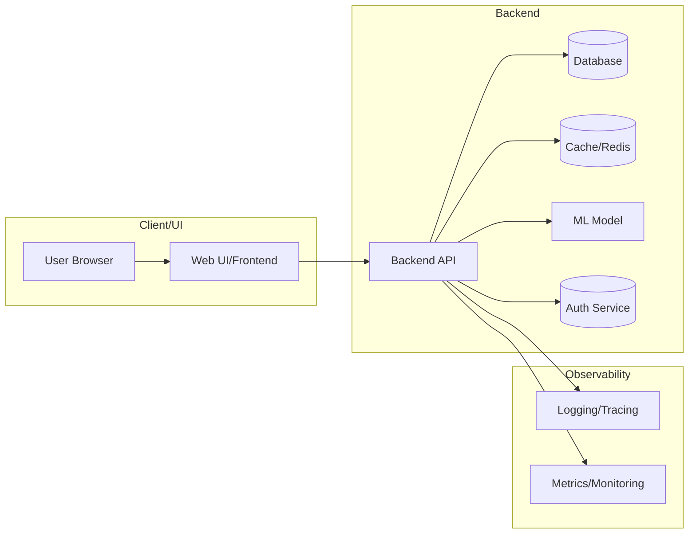

# Elderly Assistant, Simple AI Dashboard for Elderly

> **Maju Bareng AI 2026 · Hacktiv8 × Google x AVPN X Asian Development Bank**
>
> *Voice-first · Photo-aware · Single screen · Powered by Gemini 2.5*

A minimal AI companion built for elderly users; three big buttons, every answer spoken aloud, zero clutter.  Backed by Gemini 2.5, LangChain RAG, and FAISS, with a smart model router that keeps costs low on simple queries and escalates only when needed.

---

## The Problem

Most AI tools overwhelm elderly users: dense menus, tiny buttons, walls of text, silent waits.
ElderAI removes all of that.

| What they need | What most tools do | What ElderAI does |
|---|---|---|
| One action at a time | Many tabs and settings | One screen, three buttons |
| Spoken answers | Text-only output | Auto read-aloud every reply |
| Fast response | Slow, expensive models for everything | Routes simple questions to lite model |
| Plain language | Jargon-heavy replies | System prompt enforces ≤ 4 short sentences |
| Help with real life | Generic assistant | Personal KB: meds, contacts, device guides |

---

## Architecture

```
User
  ├── 🎤 Speak   → Gemini STT (inline audio, no upload latency)
  ├── ⌨️  Type    → plain text
  └── 📷 Photo   → Gemini Vision (PIL image)
            │
            ▼
   Input Validator
   (sanitize · length-guard · image-size check)
            │
            ▼
   LangChain RAG  ←──────── FAISS index (built from rag/kb/*.txt)
   (LCEL chain)             Gemini Embeddings
            │
            ▼
   Model Router
   ├── lite   KB score ≥ 0.80 AND query ≤ 40 words  (fast, cheap)
   ├── flash  KB score ≥ 0.55 OR  query ≤ 80 words  (balanced)
   └── pro    everything else                         (reasoning)
            │
            ▼
   Streaming answer  ──► Source attribution (which KB file answered)
            │
            ▼
   SQLite history  +  Structured JSON logs
            │
            ▼
   gTTS → auto-play audio
```

---

## Features

| | Feature | Detail |
|---|---|---|
| 🎤 | Voice input | Gemini Flash transcribes audio inline — no temp files |
| ⌨️ | Text input | Large input box, single big Ask button |
| 📷 | Photo input | Camera capture or file upload; vision model explains labels/docs |
| 🔊 | Auto read-aloud | gTTS reads every answer; auto-play with manual fallback |
| 🧠 | Smart router | Three-tier model selection based on KB hit score + query length |
| 📚 | Source attribution | Answers show which KB file was used (`📚 From: medications.txt`) |
| 🔐 | PIN protection | SHA-256 hashed PIN; configurable via env var |
| 💾 | Observability DB | SQLite stores model used, input type, retrieval score, latency per turn |
| 📋 | Structured logs | JSON-line logs with ts/level/event keys — APM-ready |
| 🏥 | Startup health check | Validates API key, DB path, KB files, FAISS staleness on boot |
| ✅ | Input validation | Strips control chars, normalises unicode, enforces length limits |
| 🔄 | Schema migrations | Versioned forward-only SQLite migrations with crash-safe column guards |
| ⚡ | Cached chain | `@st.cache_resource` — FAISS index built once, reused across reruns |

---

## Quick Start

### Prerequisites
- Python 3.10 or newer
- Gemini API key — get one free at [Google AI Studio](https://aistudio.google.com/)

### 1. Clone
```bash
git clone https://github.com/your-username/elderai.git
cd elderai
```

### 2. Install dependencies
```bash
pip install -r requirements.txt
```

### 3. Set your API key

**Option A — `.env` file (recommended for local dev):**
```bash
cp .env.example .env
# Open .env and set GEMINI_API_KEY=your_actual_key
```

**Option B — environment variable:**
```bash
export GEMINI_API_KEY=your_actual_key
```

### 4. Personalise the knowledge base *(optional but recommended)*

Edit the `.txt` files in `rag/kb/`:

| File | What to add |
|---|---|
| `medications.txt` | Medicine names, dosages, timing |
| `appointments.txt` | Doctor names, clinic phones, next visits |
| `contacts.txt` | Family members, neighbours, emergency numbers |
| `howto.txt` | Device guides: TV, phone, Wi-Fi, AC |
| `faqs.txt` | Common health questions in plain language |

Any `.txt` file you add is automatically indexed.

### 5. Run

```bash
make run
# or:  streamlit run app.py
```

Open **http://localhost:8501**

> Default PIN is `1234`.  
> Change it: `python -c "import hashlib; print(hashlib.sha256(b'NEW_PIN').hexdigest())"` → set `AUTH_PIN_HASH` in `.env`.

---

## Deploying to Streamlit Cloud

1. Push the repo to GitHub (`.env` and `chat_history.db` are gitignored automatically).
2. Go to [share.streamlit.io](https://share.streamlit.io) and connect your repo.
3. Set the main file to `app.py`.
4. Open **Settings → Secrets** and paste:
   ```toml
   GEMINI_API_KEY = "your_key_here"
   AUTH_PIN_HASH  = "your_pin_hash_here"
   ```
   See `.streamlit/secrets.toml.example` for the full template.
5. Deploy — the FAISS index builds automatically on first boot.

> **Note:** Streamlit Cloud resets the filesystem on redeploy, so the FAISS index rebuilds on each cold start (usually < 10 s for small KB files).  The SQLite history is also ephemeral on free tier; use a persistent volume or external DB for production.

---

## Development

```bash
make run          # start the app
make test         # run 39 unit tests (no API key needed, completes in < 1 s)
make test-cov     # tests + coverage report
make lint         # syntax-check all Python files
make clean        # delete kb_index/, chat_history.db, __pycache__
make rebuild      # clean + restart (forces FAISS index rebuild)
```

### Running tests
```bash
python -m pytest tests/ -v
```
All 39 tests are self-contained: no Gemini API, no network, no Streamlit context required.

### Adding knowledge base documents
Drop `.txt` files into `rag/kb/`, then run `make rebuild` to reindex.  
The health check at startup warns you if the KB files are newer than the FAISS index.

---

## Project Structure

```
elderai/
├── app.py                    Main Streamlit app (UI + handlers)
├── config.py                 All tunables; loads .env / st.secrets
├── router.py                 Three-tier model router (lite / flash / pro)
├── requirements.txt
├── Makefile                  run · test · clean · rebuild · lint
├── conftest.py               pytest path setup
│
├── .env.example              Local secrets template
├── .streamlit/
│   ├── config.toml           Theme (Google colours, large font)
│   └── secrets.toml.example  Streamlit Cloud secrets template
│
├── rag/
│   ├── chain.py              LCEL chain + FAISS + Gemini embeddings
│   └── kb/                   Personal knowledge base (.txt files)
│       ├── medications.txt
│       ├── appointments.txt
│       ├── contacts.txt
│       ├── howto.txt
│       └── faqs.txt
│
├── audio/
│   ├── stt.py                Gemini inline STT (no temp files)
│   └── tts.py                gTTS text-to-speech
│
├── providers/
│   └── gemini_client.py      Direct google-genai client (future use)
│
├── utils/
│   ├── auth.py               PIN gate (hashed, env-configurable)
│   ├── errors.py             Friendly elderly-safe error messages
│   ├── health.py             Startup checks: API key, DB, KB, FAISS
│   ├── history.py            SQLite with versioned migrations + WAL mode
│   ├── logger.py             Structured JSON logging (APM-ready)
│   ├── state.py              Single st.session_state initialiser
│   └── validator.py          Input sanitisation and length guards
│
└── tests/
    └── test_core.py          39 unit tests (validator, router, DB, health, config)
```

---

## Configuration Reference

All settings live in `config.py`.  Override via `.env` or Streamlit Cloud secrets:

| Variable | Default | Description |
|---|---|---|
| `GEMINI_API_KEY` | *(required)* | Key from [Google AI Studio](https://aistudio.google.com/) |
| `AUTH_PIN_HASH` | SHA-256 of `1234` | Hash of your 4-digit PIN |
| `TTS_LANG` | `en` | TTS language code (`id` for Bahasa Indonesia) |

Tunables in `config.py` (not exposed as env vars):

| Name | Default | Effect |
|---|---|---|
| `GEMINI_MODELS` | lite / flash / pro | Gemini model strings per tier |
| `ROUTER` thresholds | 0.80 / 0.55 / 40 / 80 | KB score and word-count cutoffs |
| `RETRIEVAL_THRESHOLD` | 0.40 | Minimum score for a chunk to be returned |
| `MAX_HISTORY` | 6 | Conversation turns kept in LLM context |
| `MAX_QUERY_CHARS` | 2 000 | Input truncated here before the model sees it |
| `CHUNK_SIZE` / `CHUNK_OVERLAP` | 500 / 50 | KB document splitting parameters |

---

## Troubleshooting

**"Setup required" on startup** → `.env` not found or `GEMINI_API_KEY` not set.  
**FAISS index errors** → delete `kb_index/` and restart. It rebuilds automatically.  
**Voice tab not transcribing** → Gemini STT uses the Files-compatible API; ensure your key has multimodal access.  
**TTS plays silently** → Browser may block autoplay; the audio widget is still shown — press ▶ to play manually.  
**Wrong PIN rejected** → Re-generate hash: `python -c "import hashlib; print(hashlib.sha256(b'YOUR_PIN').hexdigest())"` and update `AUTH_PIN_HASH`.  
**KB answers seem stale** → Startup health check warns if KB files are newer than the FAISS index. Run `make rebuild`.

---

## Roadmap — Hopes for the Next

### Near Term
- 🗣️ **Gemini Live API** — real-time bidirectional voice, replacing the record-transcribe loop for dramatically lower latency
- ☁️ **Google Cloud TTS** — natural, expressive voices replacing gTTS
- 🌏 **Bahasa Indonesia UI** — full localisation with language toggle
- 💊 **Medication reminders** — scheduled push notifications via Streamlit or a companion app

### Medium Term
- 👨‍👩‍👧 **Family caregiver portal** — separate view for family to update KB, review history, manage contacts remotely
- 🧠 **Cross-session memory** — remember name, preferences, recent health notes across conversations
- 📊 **Health tracking** — log blood pressure, blood sugar, weight by voice; visualise trends
- 🔐 **End-to-end encryption** — AES-256 at rest + TLS in transit for all health data
- 🌐 **Persistent cloud deployment** — managed DB + object storage for KB; survives redeploys

### Long Term
- 📱 **Flutter mobile app** — larger touch targets, haptic feedback, offline model fallback
- 👁️ **Fall detection** — continuous camera monitoring with automatic family alert
- 🏥 **BPJS / healthcare integration** — appointment booking and lab results via Indonesian public health API
- 🔈 **Wake word** — "Hei ElderAI, tolong…" — no screen tap needed
- 🌍 **Regional language support** — auto-detect and respond in Javanese, Sundanese, Batak, and other regional languages

---

## Built With

| Layer | Technology |
|---|---|
| UI | [Streamlit](https://streamlit.io) |
| LLM | [Gemini 2.5](https://ai.google.dev) (Flash-Lite · Flash · Pro) |
| Orchestration | [LangChain](https://langchain.com) LCEL |
| Embeddings | Gemini `embedding-001` |
| Vector store | [FAISS](https://github.com/facebookresearch/faiss) |
| STT | Gemini multimodal (inline audio) |
| TTS | [gTTS](https://gtts.readthedocs.io) |
| Database | SQLite with WAL mode + versioned migrations |

---



---

## Team

Built for **Maju Bareng AI 2026 · Hacktiv8 × Google x AVPN X Asian Development Bank** Final Project, a programme by [Hacktiv8](https://hacktiv8.com) in partnership with Google, AVPN, and Asian Development Bank, bringing AI education and real-world applications to Indonesia. Developed by Ahmad Bara Wirayudha.
