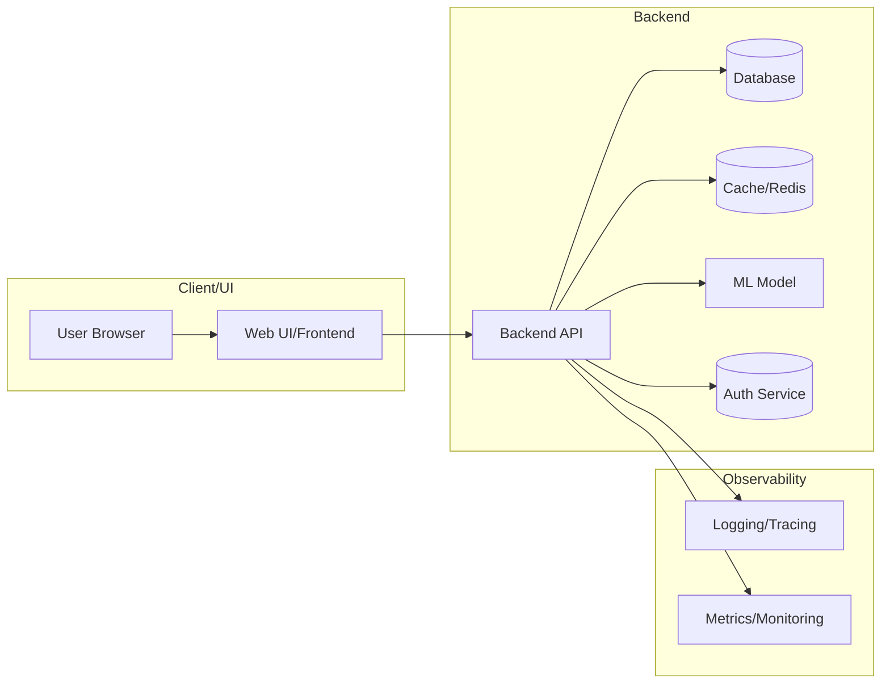

# Elderly Assistant, Simple AI Dashboard for Elderly

> **Maju Bareng AI 2026 · Hacktiv8 × Google x AVPN X Asian Development Bank**
>
> *Voice-first · Photo-aware · Single screen · Powered by Gemini 2.5*

---

## What Is this?

Most AI tools overwhelm elderly users with dense menus, tiny buttons, and walls of text.
**Elderly Assistant does the opposite.**

One screen. Three big input modes: **Speak, Type, Photo**.
Every answer is spoken aloud. No confusion. No clutter.

Built on Gemini 2.5 and LangChain RAG, it routes each query to the right model
automatically: fast and cheap for simple questions, more capable for complex ones all
invisible to the user.

---

## Features at a Glance

| Feature | Detail |
|---|---|
| 🎤 **Voice input** | Record a question; Gemini transcribes it instantly |
| ⌨️ **Text input** | Large text box with a single big button |
| 📷 **Photo input** | Point at a medicine label, document, or appliance and get a plain explanation |
| 🔊 **Auto read-aloud** | Every answer is spoken back with TTS |
| 🧠 **Smart model router** | Flash-Lite for simple hits · Flash for medium · Pro for complex reasoning |
| 📚 **Personal knowledge base** | RAG over your own docs: meds, contacts, appointments, device guides, FAQs |
| 🔐 **PIN protection** | Simple 4-digit PIN keeps family data private |
| 💬 **Chat history** | Every conversation saved to SQLite for review |
| ⚡ **Immediate acknowledgement** | "I heard you" shows before the answer, no silent wait |
| 🎨 **Elderly-first design** | 22 px base font · large buttons · high contrast · Google colour palette |

---

## Architecture

```
User
  ├── 🎤 Speak  → Gemini STT (Files API)
  ├── ⌨️ Type   → plain text
  └── 📷 Photo  → Gemini Vision (PIL image)
          │
          ▼
   LangChain RAG
   (FAISS + Gemini Embeddings → personal knowledge base)
          │
          ▼
   Model Router
   ├── Flash-Lite  — high KB score + short query
   ├── Flash       — medium confidence / moderate length
   └── Pro         — low KB score / complex reasoning
          │
          ▼
   Streaming answer  →  TTS (gTTS)
          │
          ▼
   SQLite chat history
```

---

## Quick Start

### Prerequisites

- Python 3.10 or higher
- A Gemini API key, get one free at [Google AI Studio](https://aistudio.google.com/)

---

### Step 1 - Clone the project

```bash
git clone https://github.com/your-username/elderai.git
cd elderai
```

### Step 2 - Create a virtual environment (recommended)

```bash
python -m venv venv

# Windows
venv\Scripts\activate

# macOS / Linux
source venv/bin/activate
```

### Step 3 - Install dependencies

```bash
pip install -r requirements.txt
```

### Step 4 - Add your Gemini API key

Open `config.py` and replace the placeholder:

```python
GEMINI_API_KEY = "INSERT_YOUR_KEY_HERE"
```

with your actual key from [aistudio.google.com](https://aistudio.google.com/).

### Step 5 - Personalise the knowledge base *(optional but recommended)*

Open the `.txt` files inside `rag/kb/` and fill in your real information:

| File | What to add |
|---|---|
| `medications.txt` | Medicines with dosage and timing |
| `appointments.txt` | Doctor names, clinic phones, next visit dates |
| `contacts.txt` | Family members, neighbours, emergency numbers |
| `howto.txt` | Device guides for TV, phone, Wi-Fi, etc. |
| `faqs.txt` | Common questions and answers in plain language |

You can add new `.txt` files too, they are picked up automatically.

### Step 6 - Run the app

```bash
streamlit run app.py
```

Open your browser to **http://localhost:8501**

> **Default PIN is `1234`.**
> Change it by running:
> ```bash
> python -c "import hashlib; print(hashlib.sha256(b'your_new_pin').hexdigest())"
> ```
> and pasting the output into `PIN_HASH` in `config.py`.

---

## Project Structure

```
elderai/
├── app.py                   ← Main Streamlit entry point
├── config.py                ← API key, model names, all tunables
├── router.py                ← Model selection logic
├── requirements.txt
├── README.md
│
├── .streamlit/
│   └── config.toml          ← Theme (Google colours, font, port)
│
├── rag/
│   ├── chain.py             ← LangChain LCEL chain + FAISS + Gemini embeddings
│   └── kb/                  ← Personal knowledge base (plain .txt files)
│       ├── medications.txt
│       ├── appointments.txt
│       ├── contacts.txt
│       ├── howto.txt
│       └── faqs.txt
│
├── audio/
│   ├── stt.py               ← Speech-to-text via Gemini Files API
│   └── tts.py               ← Text-to-speech via gTTS
│
└── utils/
    ├── state.py             ← Single session_state initialiser
    ├── auth.py              ← PIN gate
    ├── errors.py            ← Elderly-friendly error messages
    └── history.py           ← SQLite persistence
```

---

## Configuration Reference

All settings live in `config.py`:

| Key | Default | Description |
|---|---|---|
| `GEMINI_API_KEY` | `INSERT_YOUR_KEY_HERE` | Your key from Google AI Studio |
| `GEMINI_MODELS` | flash-lite / flash / pro | Model names per tier |
| `ROUTER` thresholds | 0.80 / 0.55 / 40 / 80 | Score and word-count cutoffs |
| `TTS_LANG` | `"en"` | Change to `"id"` for Bahasa Indonesia |
| `PIN_HASH` | `1234` (hashed) | SHA-256 hash of your PIN |
| `MAX_HISTORY` | `6` | Conversation turns kept in context |

---

## Troubleshooting

**"Please add the API key"** → Open `config.py` and insert your Gemini key.

**FAISS index errors on first run** → Delete the `kb_index/` folder and restart. It rebuilds automatically.

**Voice tab not working** → Gemini STT uploads audio to the Files API. Make sure your API key has Files API access enabled and your network allows outbound HTTPS.

**TTS has no sound** → Your browser may block autoplay. The audio widget is still shown press the play button manually.

**Very slow first startup** → The FAISS index is being built from your KB documents. This only happens once; it loads from disk on all future runs.

---

## Hopes for the Next: Roadmap

This prototype solves the core UX problem. Here is where we want to take it:

**Short-term Fixes:**  
- **Database:** Analyze slow queries using execution plans; add missing indexes on high-selectivity columns used in JOIN/WHERE.  E.g. create a composite index on frequently joined fields (most selective first).  Audit and drop unused or duplicate indexes.  Ensure all FK columns are indexed.  For example:  
  ```sql
  CREATE INDEX idx_orders_customer ON Orders(CustomerID);  -- speeds JOIN on CustomerID
  ```  
  Use proper column types (e.g. INT for IDs, DATE for dates) to save space and speed comparisons.  

- **Backend:** Enforce input validation and output encoding.  Use JSON schema or validators (e.g. Joi, Pydantic) to reject malformed input early.  Always use parameterized queries or ORM input sanitization to prevent SQL injection and XSS.  Refactor any logic buried in controllers into service layer functions for clarity.  Start writing unit tests for each function/module; use mocks to isolate dependencies.  Implement API contracts (OpenAPI) if not present, and version APIs (URL or header versioning) to handle changes.

- **UI/UX:** Audit UI components for responsiveness (use fluid layouts, CSS media queries) and accessibility (add `alt` tags, ARIA labels, ensure keyboard focus).  Use consistent design tokens and style guides.  Streamline key user flows: map each “happy path” and cut unnecessary steps.  For example, reduce form fields, or combine steps (e.g. signup + profile creation in one).  

- **Performance:** Enable caching layers.  Add an in-memory cache (e.g. Redis) for expensive read queries and API responses.  Configure HTTP caching (ETags, Cache-Control) for static assets and content.  Example:  
  ```python
  cache_key = f"user:{user_id}:profile"
  profile = cache.get(cache_key)
  if not profile:
      profile = db.query(User).filter(id=user_id).first()
      cache.set(cache_key, profile, expires=3600)
  ```  
  Use profiling tools (e.g. `EXPLAIN ANALYZE` in SQL, application profilers) to find bottlenecks.

- **Security:** Patch all dependencies to eliminate known vulnerabilities.  Enforce TLS/HTTPS.  Apply OWASP Top-10 mitigations: e.g. validate and sanitize all inputs to prevent SQL injection/XSS, enforce least-privilege on data access, and store passwords securely (bcrypt).  Perform a quick security scan (SAST/DAST).

- **Testing:** Set up automated test suite.  Write unit tests for core functions (fast, isolated).  Write integration tests covering service interactions (use test DB, mock external calls).  Start basic end-to-end tests (e.g. Selenium/Cypress) for critical user flows (login, key pages).  Integrate tests in CI pipeline to prevent regressions.  

- **Monitoring:** Instrument the code with logging (structured logs) and metrics.  Track key metrics: request latency, error rates, CPU/memory usage.  Use an APM tool (Prometheus+Grafana, ELK, Datadog) to collect metrics, logs, and traces.  Set alerts on error spikes and resource limits.  

**Medium-term Fixes:**  
- **DB Schema & Migrations:** Formalize a migration process with version control (Liquibase/Flyway).  Refactor schema for consistency: split large tables into 3NF (normalize) to improve data integrity, while denormalizing or adding summary tables for heavy read use cases.  E.g.: split `Users` and `Orders` into separate tables, link via foreign key, and create an aggregate table if needed for analytics.  Plan multi-step migrations for incompatible changes (e.g. renaming a column: add new column, backfill data, switch code, drop old column).  Maintain backups and perform migrations during low-load windows.

- **Backend Models/ORM:** Review data models and adjust relationships.  If using an ORM, profile slow ORM queries (e.g. using Django’s `.explain()` or SQLAlchemy logging) and optimize them.  For complex queries, consider raw SQL or stored procedures.  Compare ORM vs raw on a hot path in a table: 

  | Strategy | Pros | Cons |
  | -------- | ---- | ---- |
  | **ORM** (e.g. Django/SQLAlchemy) | Increases productivity and code safety (auto-escaping); fits OOP model; easy migrations & validations | Can generate inefficient queries; extra abstraction overhead; may leak N+1 queries |
  | **Raw SQL** | Full control, can hand-tune queries for performance | More verbose; higher risk of injection if not carefully parameterized; bypasses some ORM conveniences |
  
  Measure query time in each case to decide.  Use composite indexes to help ORM-generated queries join faster.

- **Caching & Queues:** Implement multi-layer caching: 
  - **Data caching:** Cache DB query results (Redis, Memcached) for idempotent reads.  
  - **HTTP caching/CDN:** Use CDN for static content, configure `max-age`.  
  - **In-app caches:** e.g. in-memory cache for per-request repeated lookups.  
  - **Message queue:** For expensive background tasks (email, reports), add a queue (RabbitMQ/Kafka) to offload work from request path.

- **UI/UX & Components:** Redesign any complex or slow components.  Break large pages into smaller components with lazy-loading (dynamic import) to speed initial load.  Ensure responsive breakpoints (mobile-first design).  Add ARIA roles/labels and ensure color contrast meets standards.  Test keyboard navigation and screen reader compatibility.  

- **Accessibility:** Verify compliance with WCAG 2.1 AA.  Example fixes: add `alt` text to images, ensure form inputs have `<label>`, provide visible focus indicator, and ensure video has captions.  Conduct an accessibility audit (automated tools like axe, manual testing).

- **Testing Expansion:** Increase coverage.  Add more unit tests to cover edge cases.  Write end-to-end tests for all major user stories.  Use contract testing for APIs (e.g. Pact) to ensure front/back integration.  Automate performance regression tests on critical paths (simulate typical load).  

- **Security Hardening:** Perform a thorough security review.  Implement Content Security Policy (CSP) headers, Secure cookies (HttpOnly/SameSite), rate-limiting to prevent brute force.  Enforce multi-factor auth.  Scan for vulnerabilities (e.g. dependency CVEs, OWASP ZAP).  Apply a strict CORS policy if applicable.

- **Monitoring/Observability:** Establish dashboards for “golden signals”: latency, throughput, errors, and saturation.  Implement distributed tracing (e.g. Jaeger) to trace user requests through services.  Use logs and metrics together: centralize logs (ELK/CloudWatch) and create alerts (error rate > X, CPU > Y).  Regularly review metrics for anomalies.

**Long-term Improvements:**  
- **Performance Tuning:** Conduct load testing and profiling.  Optimize slow SQL (add indexes or rewrite queries), scale DB reads (replication, sharding if needed).  Introduce advanced caches (covering indexes, materialized views).  Tune application: use a JIT or compile step if appropriate (e.g. PyPy, JIT compilation).  Optimize front-end performance (bundle/minify assets, tree-shake JS, preload critical resources).

- **Scalability:** If necessary, containerize and use orchestration (Kubernetes) for autoscaling.  Implement database read replicas or partitioning for scale.  Offload static content to CDN.

- **Architecture:** Consider microservices or service decomposition if the monolith grows.  Define clear API contracts (OpenAPI specs) and use an API gateway for routing/auth.  Evaluate adding search engine (Elasticsearch) if full-text search is needed.

- **ML/AI Models:** If the project uses ML (as suggested by “RAG”), version models and data.  Use tools like DVC or MLflow for model reproducibility.  Monitor model drift.  Caching RAG embeddings or GPT responses can speed up repeated queries.  Evaluate newer models periodically.

- **Continuous Improvement:** Collect user feedback for UI/UX.  Track feature usage analytics.  Plan iterative sprints to address findings from monitoring/logs.  Keep dependencies up to date and periodically audit code for tech debt.  

**Migration Plan:** Adopt schema migrations from Day 1.  Use a **blue-green or rolling** deployment strategy for database changes.  For incompatible schema changes (rename column, change type), apply a safe multi-step process: e.g. add new column, deploy code reading both old/new, backfill data, switch code, drop old column.  Always run migrations in transactions where supported to avoid partial schema state.  Schedule migrations during low-traffic windows and verify backups before altering data.  

**Testing Strategy:** Build a comprehensive test suite:  
- **Unit tests:** Fast tests for every function and class, mocking external services.  Strive for >80% coverage on critical code.  
- **Integration tests:** Use a staging environment with real DB and APIs.  Test major workflows end-to-end in CI.  
- **End-to-end (E2E):** Automate UI tests for critical user flows (login, data entry, etc).  Use headless browsers (Puppeteer/Cypress).  
- **Regression tests:** After every change, run a subset of E2E to catch interface breaks.  
- **Performance/load tests:** Regularly simulate user load to ensure the system scales.  

**Monitoring & Observability:** Follow the “three pillars”:  
- **Metrics:** Collect application metrics (latency, request rate, error rate) and infrastructure metrics (CPU, memory, DB usage).  
- **Logs:** Centralize logs with context (request IDs).  Log at appropriate levels (INFO for normal ops, WARN/ERROR for issues).  
- **Tracing:** Instrument critical transactions end-to-end.  Use distributed tracing to pinpoint bottlenecks.  
- Define SLOs and use alerts on breaches (e.g. p95 latency > target).  Continuously refine what to monitor based on production behavior.

**Security Hardening Checklist:** 
- **Authentication & Access:** Enforce least privilege.  Use strong password hashing and MFA.  Always verify permissions on every request (RBAC/ACL).  
- **Input Safety:** Escape/sanitize all user inputs; use prepared statements or ORM escape functions to prevent SQLi and XSS.  
- **Data Protection:** Encrypt sensitive data at rest and in transit (TLS).  Use secure cipher suites.  
- **Dependencies:** Keep libraries/frameworks up to date.  Remove unused code or endpoints.  
- **Configuration:** Disable debug/verbose errors in production.  Use secure headers (HSTS, CSP, X-Content-Type-Options).  
- **Logging & Audits:** Audit logs for unusual activity.  Conduct periodic security reviews (pen-tests, code scans).

**Performance Optimization Steps:**  
- **Database:** Add appropriate indexes (clustered for primary keys, non-clustered on filters).  Use partial or covering indexes on heavy queries.  Optimize queries (avoid SELECT *, use LIMIT, prefer WHERE over HAVING).  
- **Backend:** Cache results aggressively.  Use multi-threading or async I/O for concurrency if supported.  Profile hotspots with CPU/memory profilers.  
- **Frontend:** Minify assets, defer non-critical JS, compress images, enable GZIP.  Use critical CSS, prefetch key resources.  
- **API Design:** Return only needed fields to reduce payload (support `fields=` filtering).  Paginate large lists.  Support gzip compression.

---



---

## Team

Built for **Maju Bareng AI 2026 · Hacktiv8 × Google x AVPN X Asian Development Bank** Final Project, a programme by [Hacktiv8](https://hacktiv8.com) in partnership with Google, AVPN, and Asian Development Bank, bringing AI education and real-world applications to Indonesia. Developed by Ahmad Bara Wirayudha.
